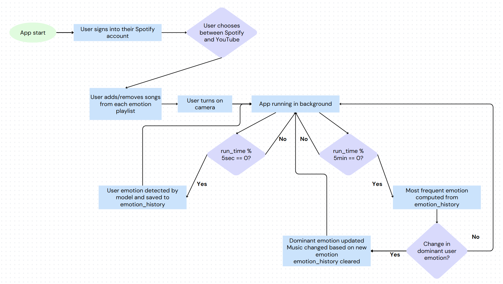

# Emotion Based Music Recommendation System

Uses the FER (Facial Expression Recognition) model to detect user's emotions and play the songs assigned to that emotion by the user. Songs are played using Spotify and YouTube APIs.

